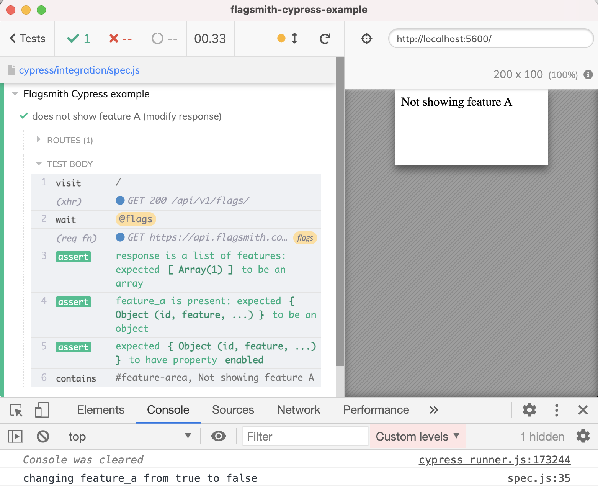

# flagsmith-cypress-example
[![ci status][ci image]][ci url] [![badges status][badges image]][badges url] [](https://dashboard.cypress.io/projects/m7knva/runs)
[![renovate-app badge][renovate-badge]][renovate-app] 
> Example controlling [Flagsmith](https://flagsmith.com/) feature flags during [Cypress](https://www.cypress.io) end-to-end tests

Read the blog post [Test Feature Flags Using Cypress and Flagsmith](https://glebbahmutov.com/blog/test-feature-flags/)



## Install and start

```shell
$ npm install
$ npm run dev
```

[renovate-badge]: https://img.shields.io/badge/renovate-app-blue.svg
[renovate-app]: https://renovateapp.com/
[ci image]: https://github.com/bahmutov/flagsmith-cypress-example/workflows/ci/badge.svg?branch=main
[ci url]: https://github.com/bahmutov/flagsmith-cypress-example/actions
[badges image]: https://github.com/bahmutov/flagsmith-cypress-example/workflows/badges/badge.svg?branch=main
[badges url]: https://github.com/bahmutov/flagsmith-cypress-example/actions
